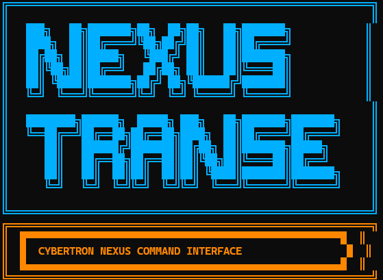

# 版本发布流程

## 1. 更新版本号

同步修改：

- [`VERSION`](../VERSION)
- [`Cargo.toml`](../Cargo.toml) `workspace.package.version`
- [`packages/nexus-engine/pyproject.toml`](../packages/nexus-engine/pyproject.toml) `version`

## 2. 本地验证

```powershell
cargo test -p nexus-core
cargo test -p nexus-cli
cd packages\nexus-engine && uv run pytest -q
.\scripts\package-release.ps1
# 解压 dist\*.zip，运行 bin\nexus.cmd engine status
```

## 3. 更新 CHANGELOG

编辑 [`CHANGELOG.md`](../CHANGELOG.md)，记录用户可见变更。

## 4. 打 tag 并推送

```bash
git add -A
git commit -m "release: v1.0.0"
git tag -a v1.0.0 -m "Nexus-Transe 1.0.0"
git push origin main
git push origin v1.0.0
```

## 5. GitHub Release

1. 打开 [Releases](https://github.com/joys852/Nexus-Transe/releases)
2. 从 tag `v1.0.0` 创建 Release
3. 附上 `dist/Nexus-Transe-*.zip` 与各平台 CLI 构件
4. 正文包含：Logo、快速开始、`LICENSE` 说明

## 6. 发布说明模板

```markdown
## Nexus-Transe v1.0.0



**Cybertron Nexus Command Interface** — 终端指挥 CLI。

### 安装

1. 下载 `Nexus-Transe-1.0.0-windows-x64.zip`
2. 解压，将 `bin` 加入 PATH 或运行 `bin\nexus.cmd`
3. 设置 `OPENAI_API_KEY`

### 变更

- 首个生产级 CLI 发行包
- Apache-2.0 开源

详见 [README](https://github.com/joys852/Nexus-Transe/blob/main/README.md)。
```
