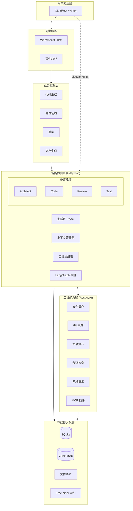
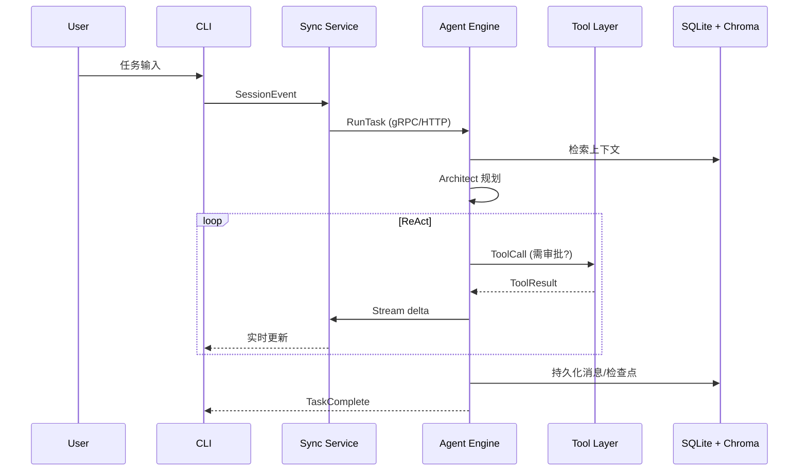
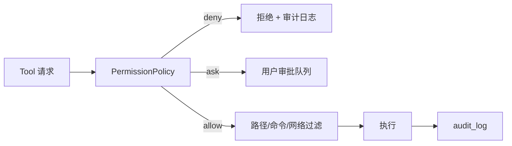
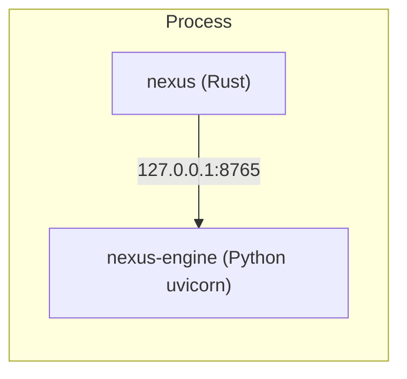

# NexusIDE — AI 驱动开发系统架构

> 统一智能体开发平台：**CLI + 共享引擎**（本地优先）

## 1. 系统总览

## 2. 数据流与主循环

## 3. 分层职责

| 层级 | 职责 | 主要技术 |
|------|------|----------|
| 存储持久化 | 配置、会话、索引、向量、检查点 | SQLite, ChromaDB, 文件系统 |
| 工具能力 | 沙箱内文件/Git/Shell/搜索/MCP | Rust (`nexus-tools`) |
| 智能体引擎 | ReAct、多 Agent、工具编排 | Python, LangGraph, Pydantic |
| 业务逻辑 | 场景化工作流（生成/审查/测试） | Engine workflows + CLI 命令 |
| 用户交互 | CLI TUI | Rust clap, rustyline, ratatui |

## 4. 核心组件

### 4.1 主循环引擎 (ReAct)

- **状态机**：`Idle → Planning → Acting → Observing → (循环|Paused|Done|Failed)`
- **检查点**：LangGraph `MemorySaver` + SQLite `checkpoints` 表，支持暂停/恢复
- **流式输出**：SSE/WebSocket 推送 token 与 tool 事件

### 4.2 上下文管理器

- **增量索引**：文件 watcher + Tree-sitter AST 切片
- **向量检索**：ChromaDB collection per workspace
- **预算控制**：token 估算 + 优先级（当前文件 > 相关符号 > 全局检索）

### 4.3 工具注册表

- 动态注册：`register_tool(definition, handler, policy)`
- 权限：`PermissionPolicy`（路径白名单、命令前缀、网络域名）
- 参数校验：JSON Schema → Pydantic / Rust `serde`

### 4.4 多智能体角色

| Agent | 职责 | 典型工具 |
|-------|------|----------|
| Architect | 任务拆解、模块边界、ADR 草案 | read, search, plan |
| Code | 编辑、生成、应用 patch | write, edit, shell |
| Review | 静态审查、安全与风格 | read, diff, lint |
| Test | 测试生成与执行 | write, shell(test) |

### 4.5 安全沙箱

### 4.6 同步服务

- **协议**：`SessionSyncProtocol`（见 `packages/shared/proto`）
- **传输**：本地 Unix socket / named pipe（Windows）+ 可选 WebSocket
- **一致性**：会话以 `session_id` 为键；乐观锁 `revision` 防并发写冲突

## 5. 技术选型与风险评估

| 选型 | 理由 | 风险 | 缓解 |
|------|------|------|------|
| Rust CLI + core | 性能、安全、单二进制分发 | 与 Python 引擎跨语言集成复杂 | HTTP sidecar + 共享 proto；`nexus-core` 库复用 |
| LangGraph | 有状态图、检查点、多 Agent | API 迭代、Python GIL | 隔离进程；版本锁定；集成测试 |
| ChromaDB | 嵌入式、本地优先 | 大规模索引内存 | 分 collection；定期 compaction |
| Tree-sitter | 多语言 AST、增量解析 | 语言 grammar 维护 | 按需启用语言；缓存 AST |
| SQLite | 零运维、嵌入式 | 写并发 | WAL；会话分库；写队列 |

## 6. 分阶段开发计划

### Phase 1 — MVP（8–10 周）

- [ ] `nexus-core`：配置、SQLite 迁移、基础工具（read/write/glob）
- [ ] Agent Engine：单 Agent ReAct + 多协议模型适配
- [ ] CLI：`nexus chat`、`nexus run`、流式 TUI
- [ ] 同步：会话与事件（本地）

### Phase 2 — Beta（8 周）

- [ ] 四 Agent 编排 + Architect 规划节点
- [ ] Tree-sitter 索引 + Chroma 检索
- [ ] Git 工具、Shell 审批流、审计日志
- [ ] MCP 插件加载
- [ ] 多模型：本地推理端点、Chat Completions 兼容中转

### Phase 3 — 正式版（持续）

- [ ] 插件 SDK（Rust + TS）
- [ ] 团队配置同步、远程会话（可选）
- [ ] 性能：冷启动 < 2s、索引增量 < 500ms
- [ ] 企业：策略模板、SSO、合规导出

## 7. 部署拓扑（本地）

默认由 CLI 在首次使用时 **spawn** engine sidecar；也可 `nexus engine serve` 独立运行。
